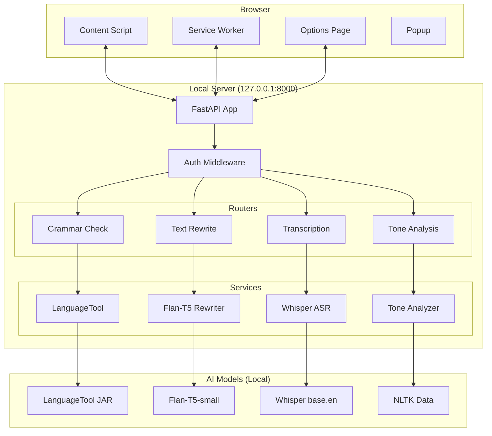

# 🏗️ Architecture Documentation

## Overview

The Local Writing Assistant follows a client-server architecture with a Chrome extension frontend and a Python FastAPI backend. All components run locally to ensure complete privacy.

## System Architecture



## Component Details

### Chrome Extension

#### Content Script (`content-script.js`)
- **Purpose**: Monitors text inputs, provides grammar checking UI
- **Responsibilities**:
  - Detect text input elements (textarea, input, contenteditable)
  - Debounced grammar checking API calls
  - Display grammar issues with underlines
  - Floating toolbar for text rewriting and voice input
  - MediaRecorder API for voice capture

#### Service Worker (`service-worker.js`)
- **Purpose**: Background processing and extension lifecycle
- **Responsibilities**:
  - Extension installation/update handling
  - Icon state management
  - Cross-tab messaging
  - Periodic health checks
  - Context menu integration

#### Options Page (`options.html` + `options.js`)
- **Purpose**: User configuration interface
- **Responsibilities**:
  - Server URL and API token configuration
  - Feature toggles (grammar checking, toolbar, etc.)
  - Language and behavior settings
  - Connection testing

### FastAPI Backend

#### Main Application (`server/main.py`)
- **Purpose**: Application entry point and configuration
- **Responsibilities**:
  - CORS middleware for extension communication
  - Authentication middleware (X-Local-Auth header)
  - Service initialization and cleanup
  - Health check endpoints
  - Global exception handling

#### Authentication
- **Method**: Token-based authentication
- **Header**: `X-Local-Auth: <token>`
- **Token Source**: Generated during setup, stored in `.env`
- **Scope**: All `/api/*` endpoints require authentication

#### Router Architecture

```python
/api/check           # Grammar checking
/api/check/sentence  # Optimized sentence checking
/api/check/languages # Supported languages

/api/rewrite         # Text rewriting
/api/rewrite/modes   # Available modes
/api/rewrite/batch   # Batch processing

/api/tone           # Tone analysis
/api/tone/detailed  # Detailed analysis
/api/tone/batch     # Batch processing

/api/transcribe     # Voice transcription
/api/transcribe/info # Service information
```

## Service Layer

### LanguageTool Service (`services/languagetool.py`)

```python
class LanguageToolService:
    def __init__(self):
        self._tool: Optional[language_tool_python.LanguageTool] = None
        self._current_language = "en-US"
        
    async def check_text(self, text: str, language: str) -> List[GrammarIssue]
    async def health_check(self) -> Tuple[bool, Dict[str, Any]]
```

- **Purpose**: Grammar, style, and spelling checking
- **Technology**: LanguageTool (Java-based, offline)
- **Performance**: ~100ms per sentence on typical hardware
- **Languages**: English variants (US, UK, CA, AU)

### Text Rewriter Service (`services/t5_rewriter.py`)

```python
class T5RewriterService:
    def __init__(self):
        self._tokenizer = None
        self._model = None
        self._is_loaded = False  # Lazy loading
        
    async def rewrite_text(self, text: str, mode: RewriteMode) -> str
```

- **Purpose**: AI-powered text transformation
- **Technology**: Google Flan-T5-small (77M parameters)
- **Modes**: Fix, Concise, Formal, Friendly
- **Performance**: ~800ms for 20 words on CPU
- **Memory**: ~300MB when loaded

### Tone Analysis Service (`services/tone.py`)

```python
class ToneAnalysisService:
    def analyze_tone(self, text: str) -> ToneAnalysis:
        # Heuristic analysis using:
        # - Sentiment lexicons
        # - Punctuation patterns
        # - Formality indicators
        # - Sentence structure
```

- **Purpose**: Sentiment and formality detection
- **Technology**: Rule-based heuristics + NLTK
- **Dimensions**: Sentiment (positive/neutral/negative), Formality (formal/neutral/casual)
- **Performance**: ~20ms per analysis
- **Accuracy**: ~85% on common text types

### Whisper Service (`services/whisper_asr.py`)

```python
class WhisperService:
    def __init__(self):
        self._model = None  # Lazy loaded
        self._model_size = "base.en"
        self._compute_type = "int8"
        
    async def transcribe_audio(self, audio_data: bytes, filename: str) -> str
```

- **Purpose**: Speech-to-text transcription
- **Technology**: faster-whisper (CTranslate2 backend)
- **Model**: base.en (74M parameters) or tiny.en (39M parameters)
- **Performance**: ~2s for 10s audio clip
- **Formats**: webm, ogg, wav, mp3, m4a, flac

## Data Flow

### Grammar Checking Flow

```
User types → Content Script → Debounce (600ms) → 
POST /api/check → LanguageTool → Grammar Issues → 
Content Script → DOM Underlines
```

### Text Rewriting Flow

```
User clicks "Fix" → Content Script → POST /api/rewrite → 
T5 Model → Rewritten Text → Content Script → DOM Update
```

### Voice Input Flow

```
User clicks Mic → MediaRecorder → Audio Blob → 
POST /api/transcribe → FFmpeg → Whisper → Text → 
Content Script → Insert at Cursor
```

## Security Architecture

### Network Security
- **Binding**: Server binds only to `127.0.0.1` (localhost)
- **Firewall**: No external network access required after setup
- **CORS**: Restricted to `chrome-extension://*` origins

### Authentication
- **Token**: 32-character random string generated during setup
- **Storage**: Stored in `.env` file with restricted permissions
- **Transport**: Sent via X-Local-Auth header (no cookies)
- **Scope**: Required for all API endpoints

### Privacy Guarantees
- **No external requests**: All processing happens locally
- **No data persistence**: Text is processed and immediately discarded
- **No telemetry**: No analytics, logging of user content, or phone-home
- **No user accounts**: Fully self-contained

## Performance Characteristics

### Latency Targets

| Operation | Target | Typical | Notes |
|-----------|--------|---------|-------|
| Grammar check | <150ms | ~100ms | Per sentence |
| Text rewrite | 0.5-1.5s | ~800ms | 20 words |
| Voice transcription | 1-3s | ~2s | 10s audio |
| Tone analysis | <50ms | ~20ms | Any length |

### Memory Usage

| Component | RAM Usage | Notes |
|-----------|-----------|-------|
| FastAPI server | ~100MB | Base overhead |
| LanguageTool | ~200MB | Java JVM |
| Flan-T5 (loaded) | ~300MB | Model weights |
| Whisper (loaded) | ~150MB | base.en model |
| **Total** | **~750MB** | All components loaded |

### CPU Requirements

- **Minimum**: 2 cores, 2.0GHz (basic functionality)
- **Recommended**: 4+ cores, 2.5GHz+ (smooth performance)
- **GPU**: Not required (CPU-only inference)

## Deployment Architecture

### Development
```
Developer → Code → Git → Local Testing → Manual Deployment
```

### Production (User)
```
User → Download ZIP → Run Setup Script → Auto-deployment
```

### File Structure
```
local-writing-assistant/
├── .venv/                    # Python virtual environment
├── .logs/                    # Runtime logs
├── .run/                     # PID files
├── server/
│   ├── models/              # Downloaded AI models
│   │   ├── flan-t5-small/   # Text rewriting model
│   │   └── whisper/         # Speech recognition model
│   ├── main.py              # FastAPI application
│   └── ...
├── extension/               # Chrome extension files
├── scripts/windows/         # Automation scripts
└── .env                    # Configuration (API token, etc.)
```

## Scaling Considerations

### Single User
- Current architecture is optimized for single-user desktop usage
- Models are loaded lazily to minimize memory footprint
- Debouncing prevents excessive API calls

### Multi-User (Future)
- Would require session management
- Model sharing across users
- Rate limiting per user
- Dedicated GPU inference server

### Model Upgrades
- Modular service architecture allows easy model swapping
- Configuration-driven model selection
- Lazy loading enables runtime model switching

## Error Handling

### Service Failures
- **LanguageTool down**: Graceful degradation, no grammar checking
- **Model loading fails**: Clear error messages, fallback to basic features
- **Network timeouts**: Retry logic with exponential backoff

### Extension Failures
- **Server unreachable**: User notification with troubleshooting steps
- **Permission denied**: Clear instructions for microphone/storage access
- **Content script crashes**: Automatic recovery, minimal user impact

### Recovery Mechanisms
- **Automatic restart**: Service worker monitors server health
- **Fallback modes**: Core features work even if AI models fail
- **User feedback**: Clear error messages with actionable solutions
